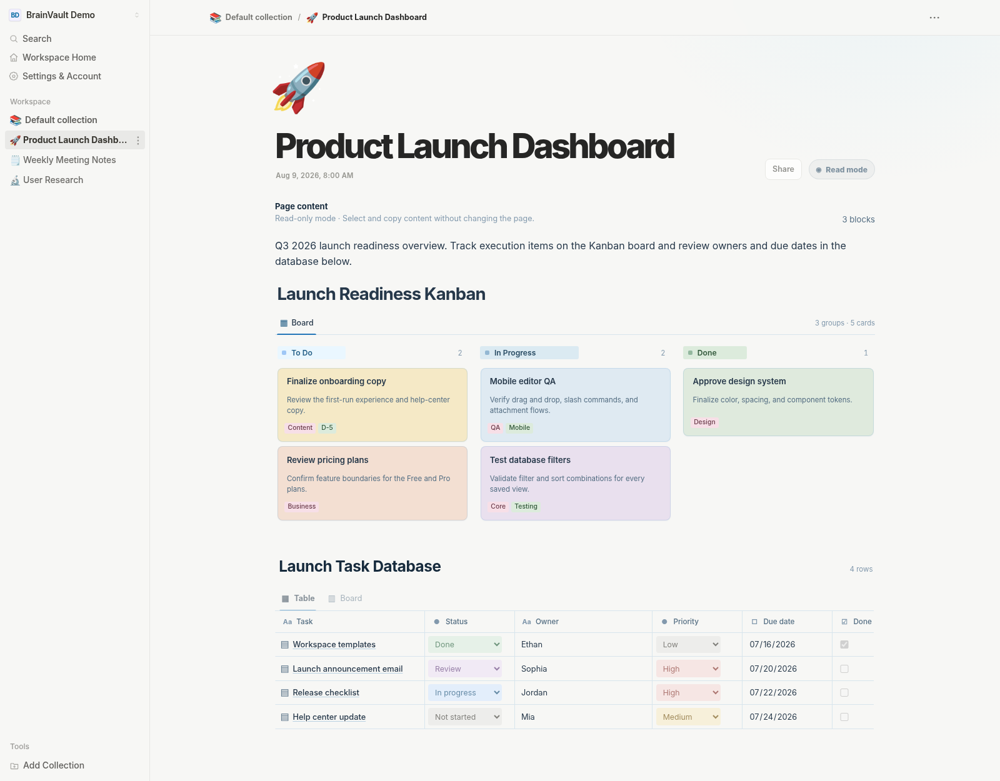

# BrainVault

BrainVault is a self-hosted, block-based note app built with Node.js, Express, TypeScript, and MariaDB. It combines a focused browser workspace with a REST API, so it can be used as both a personal writing environment and a backend for other clients.

Every row on a page is an editable block that can be formatted, moved, nested, or converted without switching to a separate preview pane.

## Preview



The preview is captured from the real browser UI. See [Development guide](docs/development/2026-07-28/development.md#preview-capture) to regenerate it.

## Key features

- Block editor with slash commands, nested content, drag-and-drop ordering, tables, databases, Kanban boards, and Gantt timelines
- Rich text, Markdown, syntax-highlighted code blocks, callouts, bookmarks, privacy-enhanced video embeds, file attachments, AI conversation blocks, and KaTeX formulas
- Crash-resilient browser drafts, automatic title saving, and search across page titles and block content
- Owner- and administrator-managed sharing: ordinary pages use direct `EDIT` grants, while custom collections use inherited `READ`, `WRITE`, or `ADMIN` grants; shared documents use Yjs live synchronization, presence, reconnect recovery, and MariaDB persistence
- Page collections, nesting, built-in or custom cover images with adjustable focal positions, archiving, permanent deletion, PDF export, and complete ZIP backup/restore including page and collection sharing grants, page version history, owned-page navigation state, every account attachment-upload file, and uploaded custom-icon assets
- Custom page/collection icon uploads stored as physical files under `upload/icons/`; MariaDB stores only the generated file path, and missing files fall back to the default page icon
- JWT authentication with an HttpOnly browser session cookie, profile settings, TOTP authenticator support, multiple WebAuthn/FIDO2 passkeys, and passwordless passkey-first login from the sign-in screen
- Seven interface languages: English, Japanese, Korean, French, German, Spanish, and Portuguese
- Private attachment storage, sanitized Markdown rendering, rate limiting, and validated bookmark previews
- Automatic MariaDB bootstrap and migrations, plus an included OpenAPI 3.1 specification
- Production HTTPS via a Posh-ACME certificate directory or a trusted Caddy, Synology DSM, NGINX, or Nginx Proxy Manager reverse proxy

## Collection sharing

BrainVault can share an entire **custom collection** with another existing BrainVault account. A collection grant covers the collection and every document page currently inside it, including nested descendant pages. Pages created in or moved into the collection inherit the collection grant; pages moved out stop inheriting it.

**Where to find the UI:** click a custom collection's **name** in the left sidebar to open the collection landing view. Owners and users with `ADMIN` collection permission see **Share collection** next to **Add page**. The button is intentionally hidden for the virtual **Default Collection**, while an individual document page is open, and for `READ`/`WRITE` collection collaborators. Direct sharing of a single ordinary page remains available from that page's **Share** button.

| Collection permission | Effective access |
| --- | --- |
| `READ` | View the collection and its document hierarchy. Shared documents can receive live Yjs updates, but this user cannot write them. |
| `WRITE` | Everything in `READ`, plus editing shared document titles/blocks and other writable document content. It does not grant sharing or page-administration controls. |
| `ADMIN` | Everything in `WRITE`, plus collection sharing and page/collection administration allowed by the server. An administrator cannot move pages outside the shared collection's scope. |

A collection grant is authoritative for a user inside that collection and takes precedence over a direct page `EDIT` grant. For example, a collection-level `READ` grant keeps member pages read-only for that user even if an older direct `EDIT` grant is still stored for one of those pages. If the collection grant is later removed, a still-valid direct page grant can become effective again.

Collection sharing is persisted in `collection_shares`, while `page_collection_memberships` materializes each page's collection scope. Current version 4 backups round-trip collection grants in addition to direct page grants. See [Collection sharing](docs/collaboration/2026-09-02/collection-sharing.md) for UI behavior, permission semantics, API routes, inheritance rules, backup behavior, and troubleshooting.

## Syntax-highlighted code blocks

Code blocks include a language selector, a live highlighted preview, persisted language metadata, read-only/PDF rendering, and highlighted fenced code inside Markdown blocks. Highlight.js assets are served locally from `public/vendor/highlight`, so code highlighting does not require a third-party CDN. To bound synchronous regular-expression work on untrusted notes, blocks longer than 2,000 code units or server highlights that exceed 25 ms fall back to complete HTML-escaped plain text; browser hydration also has an aggregate work budget.

Supported selectors include C, C++, C#, Java, Python, Dart, Rust, Lua, Ruby, Perl, Bash, PowerShell, JSON, SQL, XML, YAML, Markdown, HTML, JavaScript, CSS, PHP, VB.NET, BASIC, Assembly, Delphi, Lisp, TypeScript, CoffeeScript, COBOL, Fortran (`POTRAN` is accepted as an alias), MATLAB, Kotlin, Objective-C, Swift, and Haskell.

## Stack

| Area | Technology |
| --- | --- |
| Runtime | Node.js 22.23.2+/24.18.1+/26.5.1+, Express 5, TypeScript |
| Database | MariaDB |
| Frontend | Vanilla HTML, CSS, and JavaScript, with Yjs 13.6.31 for shared documents |
| Auth | JWT, bcrypt, TOTP, and WebAuthn/FIDO2 |
| Validation and rendering | Zod, markdown-it, sanitize-html, and KaTeX |
| Testing | Vitest and Supertest |

## Quick start

Requirements: Node.js 22.23.2 or newer within the 22.x line, Node.js 24.18.1 or newer within the 24.x line, or Node.js 26.5.1 or newer; npm 10.9 or newer; and a reachable MariaDB server.

```bash
npm run db:configure
npm install
npm run setup
npm run dev
```

`npm run dev` opens `http://localhost:4000` automatically in a private/incognito window after the server is ready. It never falls back to a normal browser profile.

Custom icon uploads are written to `upload/icons/<user-id>/`. Keep the project `upload/` directory on persistent storage in production; it is runtime data and is ignored by Git. Migration `041_custom_icon_files.sql` creates the MariaDB path-reference library used by the custom-icon picker.

For database permissions, opt-in demo data, alternative environment setup, and production instructions, see the [Getting started guide](docs/getting-started/2026-07-27/getting-started.md).

## Documentation

| Guide | Contents |
| --- | --- |
| [Documentation index](docs/README.md) | Entry point for all project documentation |
| [Getting started](docs/getting-started/2026-07-27/getting-started.md) | Requirements, secure setup, database bootstrap, opt-in demo data, and production |
| [Features](docs/features/2026-07-30/features.md) | Editor behavior, sharing, block types, backup/restore, PDF export, and languages |
| [Collaboration](docs/collaboration/2026-07-29/collaboration.md) | Sharing permissions, Yjs/WebSocket flow, persistence, proxy setup, and verification |
| [Collection sharing](docs/collaboration/2026-09-02/collection-sharing.md) | Custom-collection UI entry point, READ/WRITE/ADMIN permissions, inheritance, API routes, and troubleshooting |
| [Collaboration verification](docs/data-loss/2026-07-29/collaboration-verification.md) | Delivery checks, integrity-proof scope, and reproducible deployment validation |
| [Data-loss and integrity reports](docs/README.md#data-loss-and-integrity-reports) | Dated audits, reproductions, corrections, and verification evidence |
| [In-depth review and remediation results](docs/data-loss/2026-08-05/in-depth-review-and-remediation-results.md) | Consolidated authentication-boundary, idempotency, deletion-atomicity, and verification findings |
| [Page-cover integrity review](docs/data-loss/2026-08-04/page-cover-integrity-review.md) | Backup v2, async race, preview, asset-loading, and regression corrections |
| [Page-cover follow-up review](docs/data-loss/2026-08-05/page-cover-interaction-and-pdf-regression-review.md) | Dialog cancellation, cross-page draft scope, PDF measurement, and restore ambiguity |
| [Complete uploaded-asset backup review](docs/data-loss/2026-08-10/complete-upload-asset-backup-restore.md) | Backup v3 complete upload assets, account-ID rebinding, and crash-safe multi-asset restore |
| [Backup workspace-state round-trip review](docs/data-loss/2026-08-11/backup-workspace-state-roundtrip-integrity.md) | Backup v4 page-history/navigation-state completeness, rebinding, and restore conflict fencing |
| [Account-security and UI request-scope review](docs/data-loss/2026-08-05/account-security-and-ui-request-scope.md) | Authentication-boundary privacy, page-share request identity, and latest navigation intent |
| [Authentication, account-data, and editor-lock boundary review](docs/data-loss/2026-08-05/auth-data-and-lock-boundary-review.md) | Boot/login supersession, backup account scope, and cross-authentication lock ownership |
| [Block-delete response-loss idempotency review](docs/data-loss/2026-08-05/block-delete-response-loss-idempotency.md) | Committed DELETE acknowledgement, exact mutation replay, and attachment cleanup healing |
| [Configuration](docs/configuration/2026-07-28/configuration.md) | Environment variables and runtime configuration |
| [HTTPS deployment](deploy/README.md) | Direct Posh-ACME TLS plus Caddy, Synology DSM, NGINX, and Nginx Proxy Manager setup |
| [Security](docs/security/2026-07-30/security.md) | MFA, production secrets, attachment safety, and security defaults |
| [Security review and remediation report](docs/security/2026-08-04/security-review-and-remediation-report.md) | Security findings, reproductions, remediations, and verification limits |
| [Direct passkey-login verification](docs/security/2026-08-09/passkey-direct-login-verification.md) | Discoverable-credential design, threat model, attack reproductions, and verification evidence |
| [API](docs/api/2026-07-30/api.md) | Route overview, authentication, health check, and OpenAPI access |
| [Development](docs/development/2026-07-28/development.md) | Scripts, lockfile policy, project structure, translations, and preview capture |
| [OpenAPI specification](docs/api/2026-07-30/openapi.yaml) | Full OpenAPI 3.1 document |

## Common commands

```bash
npm run dev       # Start the server and open a private/incognito browser window
npm run secrets:generate # Print independent 32-byte JWT and MFA secrets
npm test          # Run the test suite
npm run build     # Integrity-vendor Mermaid, then compile TypeScript
npm run reproduce:cross-instance-loss # Reproduce the stale-room compaction loss and fixed behavior
npm run reproduce:attachment-position-loss # Reproduce stale-SQL attachment position loss and the fixed merge
npm run reproduce:page-cover-backup-manifest # Reproduce inline-cover manifest exhaustion and the v2 fix
npm run reproduce:backup-workspace-state-loss # Reproduce v3 page-history/navigation loss and the v4 correction
npm run reproduce:page-cover-operation-scope # Reproduce picker-cancel and cross-page draft races
npm run reproduce:page-cover-pdf-layout # Reproduce full-bleed PDF measurement regression
npm run reproduce:block-preserve-children-delete # Reproduce partial hierarchy commit and atomic rollback
npm run reproduce:block-delete-response-loss # Reproduce committed-delete response loss and idempotent acknowledgement
npm run reproduce:passkey-direct-login # Generate a P-256 assertion and replay the passkey-login attack matrix
npm run verify:collaboration # Check collaboration wiring, protocol behavior, and source syntax
npm run verify:data-loss # Check persistence and recovery integrity guards
npm start         # Run the compiled server
```

Before a production deployment, provide explicit unique secrets, configure the browser origins, leave registration disabled unless it is intentionally required, and serve the app over HTTPS in a browser that supports Web Locks so safety-critical cross-tab transitions can run. To let BrainVault serve Posh-ACME's `fullchain.cer` and `cert.key` directly, use `HTTPS_MODE=posh-acme` and set `POSH_ACME_CERT_PATH`. For TLS termination in Caddy, Synology DSM, NGINX, or Nginx Proxy Manager, use `HTTPS_MODE=proxy`. Follow the [HTTPS deployment guide](deploy/README.md), then see [Security](docs/security/2026-07-30/security.md) and [Configuration](docs/configuration/2026-07-28/configuration.md).

## Security report remediation (2026-09-11)

The supplied REPORT.md was checked against this source archive. The changes below address confirmed risks; this is not a certification that the application is vulnerability-free.

| Finding | Verification and disposition |
| --- | --- |
| BV-01 | Confirmed. The long-window login limiter now keys by normalized username plus normalized source IP. One source cannot consume another source's six-hour budget. The existing database-backed account lockout remains in place against distributed password guessing, including its default 15-minute maximum lock duration. |
| BV-02 | Confirmed. Registration now applies the per-IP limiter and body validation before the global limiter. With default limits, one source can consume at most five of the twenty global slots per window. Distributed exhaustion and deployments configured with a per-IP allowance at least as large as the global allowance remain subject to the intentional global cap. |
| BV-03 | Content-type mismatch behavior confirmed, but no exploitable stored XSS was established. HTML source is valid plain-text content. Forced attachment disposition, safe response MIME types, sandbox CSP, and nosniff remain essential and are preserved. JSON and other unsigned formats are not certified by content inspection; this check is not malware scanning. No blanket rejection of text or arbitrary binary attachments was added. |
| BV-04 | Confirmed forged-icon validation gap. Backup metadata integrity now applies the shared icon validator's decoded-size and image-signature checks to inline image icons. Invalid data is rejected before restore. Legacy metadata is preserved without imposing the full normal-write canonical model on older backups. |
| BV-05 | Confirmed expired-session retention. Indexed cleanup deletes at most 1,000 expired session rows at startup and each minute, without overlapping runs. A historical backlog drains over successive runs. Unexpired revoked rows remain as revocation tombstones until token expiry, because deleting them sooner could recreate an active session. |
| BV-06 | Confirmed rename boundary gap. Rename now requires currentPassword, the account reauthentication limiter, and a transaction that locks and validates the current account, workspace generation, session, and owned passkey. The browser sends the password from the existing MFA password field. Unlike a key replacement, a label change does not rotate credentials. The report overstates sibling-route consistency: existing credential mutations do not all call the shared full session-boundary helper. |
| BV-07 | Confirmed verification drift. Corrected the reported trackClient and restoredMetadata expectations and the verifier's obsolete in-process collaboration materialization expectation. Added focused regression coverage to verify:security. Also fixed a missing collaborationResourceLimits import and an undefined ZIP-test fixture variable that prevented TypeScript compilation. Other unrelated suite failures remain; see validation limits below. |

### Applying the update

Run the normal dependency installation and database migration workflow (`npm ci`, `npm run db:migrate`, `npm run build`) before restarting the application. New migration `075_auth_session_expiry_index.sql` adds an expiry index; it does not delete account data. Automatic database bootstrap also applies pending migrations when enabled. If automatic bootstrap is disabled, apply migrations explicitly before starting this version.

API clients calling `PATCH /api/auth/mfa/passkeys/:id` must now send both `name` and `currentPassword`. Existing attachment download behavior and valid legacy icon backups remain supported. The archive retains the original project paths and existing Git metadata. It contains no generated audit report or additional log files.

### Validation and limits

- `npm run build`: passed on Node.js 24.19.0.
- `npm run verify:security`: passed all 100 existing security checks/tests plus 10 new focused regression tests.
- Browser JavaScript syntax and lockfile registry checks: passed.
- `npm run test:unit`: did not pass. The broader run encountered a sandbox network-interface enumeration error during collection and existing assertion failures. The report's exact 133/626 failure count was not independently reproduced in this environment.
- `npm run verify:data-loss`: still stops at the pre-existing browser-recovery assertion, "Block edits can still remain visible when their browser recovery write fails". Correcting earlier obsolete assertions does not establish that every remaining data-loss invariant passes.
- Regression tests exercise real middleware, validation, and route handlers with database mocks. The test-only network-interface fixture is not a production change. Live MariaDB migrations, transaction locking, browser interaction, and deployed proxy behavior were not exercised here.

Reference guidance: [OWASP Authentication Cheat Sheet](https://cheatsheetseries.owasp.org/cheatsheets/Authentication_Cheat_Sheet.html) discusses account-lockout denial of service and sensitive-operation reauthentication. [OWASP File Upload Cheat Sheet](https://cheatsheetseries.owasp.org/cheatsheets/File_Upload_Cheat_Sheet.html) explains why declared content types and file signatures must not be treated as complete content safety guarantees.


## Recovery maintenance review (2026-09-11)

Confirmed issue: a failed IndexedDB recovery write left newer text or binary
edits only in the synchronous mirror. A later explicit refresh or cross-tab
notification replaced that mirror with the older durable record, discarding the
remaining recovery copy. Conditional cleanup and legacy reconciliation could
also replace that mirror after a failed write.

The recovery adapter now tracks uncommitted writes by mutation generation.
Backing-store reconciliation preserves these values until the exact write
commits. Explicit deletion and clear remain supported; if either fails, the
unsaved value and its protection are restored. This retains the existing strict
transaction durability, atomic comparison, account/source key namespaces, and
legacy migration receipts. It does not add endpoints or HTML rendering paths.
A failed write still requires a successful retry before closing the tab; an
in-memory copy is not a durable backup.

Reproduction on the original version:

1. Persist an old draft with setItem and await flush.
2. Force the next strict IndexedDB write to fail, then write a newer text value
   with setItem or binary value with setObject. Observe flush rejecting.
3. Restore storage availability without retrying that write.
4. Call refresh, or deliver a peer recovery-change notification for the key.
5. Observe the old durable draft replacing the newer in-memory value. With this
   patch, the newer value survives and can be retried, persisted, and reopened.

Automated reproduction and regression command:

```sh
node --test tests/indexeddb-recovery-storage.node.test.mjs
```

Validation: all 54 recovery-storage tests passed, including 11 new regressions.
The four initial text/binary refresh reproductions failed on the original code
and passed after remediation. Four authenticated-cache isolation checks passed.
The npm build completed successfully. Selected Vitest suites yielded 55 passing
tests and two failing tests; both failures reproduced against the untouched
archive (foreign-source draft cleanup expectations and registration limiter
ordering). Three route/security suites could not initialize because this CI
runtime's os.networkInterfaces call raises a system error. Live MariaDB and
real-browser integration were not validated; this is not a claim that the entire
application is free of defects or vulnerabilities.

Review scope: recent Git history; browser recovery, draft acknowledgement and
save queues; database transaction durability; page/block deletion snapshots,
version checks, owner access checks, and mutation replay handling. The source
patch is confined to public/indexeddb-recovery-storage.js. Regression additions
are in tests/indexeddb-recovery-storage.node.test.mjs.

References consulted:
[IndexedDB transaction semantics](https://developer.mozilla.org/en-US/docs/Web/API/IDBTransaction)
and [OWASP authorization guidance](https://cheatsheetseries.owasp.org/cheatsheets/Authorization_Cheat_Sheet.html).

Packaging preserves every original archive entry and its project path. The
original .git ZIP members, including their compressed payloads and metadata, are
copied unchanged. Git inspection used Python subprocess with optional locks
disabled; no Git commits, index updates, or object-file parsing were performed.
Installed dependencies and generated build/test files are not included.


## Recovery durability barrier maintenance (2026-09-11)

This maintenance pass follows HEAD b6c39ff and its intent to retain unsynchronized
text and binary drafts after IndexedDB failures. Git inspection used read-only
Git CLI commands through Python subprocess with GIT_OPTIONAL_LOCKS=0. The archive
source differs from HEAD only in line endings before this patch.

### Confirmed defects and fixes

Concurrent flush callers shared one mutable failure acknowledgement. One caller
could consume the error and let another report success for the same failed
transaction. Each flush now captures its own failure observation boundary.

After a failed put, the queue drained while the only newer draft remained in
memory. Subsequent flush calls could succeed, and hasPendingWrites returned
false. The app uses that method in its before-unload protection. Both APIs now
continue reporting the unsaved condition until the draft is durably retried or
explicitly removed. Saving a different key or refreshing storage cannot clear it.

Queued delete/clear rollback snapshots now share per-write commit receipts. If a
preceding put commits while deletion is queued, a failed deletion does not restore
that already-committed generation as an uncommitted draft. Existing generation
fences continue protecting newer edits and explicit successful deletions.

### Reproduction and verification

1. With the existing FakeIndexedDb harness, initialize recovery storage, set
   ignoreDurability=true, and call setItem or setObject with an unsaved draft.
2. Start two flush calls together using Promise.allSettled. Before the patch,
   one rejects and one fulfills. Both must reject after the patch.
3. Call flush again and inspect hasPendingWrites without retrying the draft.
   Before the patch, flush fulfills and the guard is false. After the patch,
   flush rejects and the guard stays true. A different key's successful save
   must not change that result.
4. Restore strict durability and retry the same draft. Flush must succeed,
   the pending guard must clear, and reopening storage must recover the bytes.
5. Separately, persist a draft, inject a deletion failure, and start two flush
   callers after removeItem. Both must report the failure, and the durable draft
   must remain recoverable. This case has no outstanding failed put.
6. For rollback regression coverage, queue a put immediately followed by a
   failing removeItem or clear. The put commits first. After observing the
   deletion error, its restored durable value must not remain marked unsaved.

Run the focused suite with:

```sh
node --test tests/indexeddb-recovery-storage.node.test.mjs
```

Validation: all 59 focused tests pass, including five added cases. Four existing
parameterized cases now explicitly require flush to reject while a failed draft
remains uncommitted; their data-preservation assertions are retained. The build
passes. The broader durability run passes 976 of 980 tests; all four failures also
occur on the original archive. The original run has one additional failure in a
standalone reproduction. The unit runs report the same 307 passing and 27 failing
assertions on original and patched source; additional suite-loading failures and
sandbox network-interface restrictions prevent a clean full-suite result.
Existing failures were not suppressed or represented as passing.

The audit also inspected public/app.js, public/draft-store.js,
public/collaboration-recovery-store.js, src/lib/db.ts, and the page/block mutation
routes. The patch changes only local recovery bookkeeping and its tests, adding
no HTML rendering, network endpoints, SQL, or authorization bypass. Existing
account/source keys and atomic compare operations are retained. Live-browser
IndexedDB behavior and live MariaDB integration were not validated here; the
fault-injection harness is not a full browser transaction simulator.

Reference checks: IndexedDB transaction completion signifies successful commit
(https://developer.mozilla.org/en-US/docs/Web/API/IDBTransaction/complete_event).
Object access must retain per-object authorization checks
(https://cheatsheetseries.owasp.org/cheatsheets/Insecure_Direct_Object_Reference_Prevention_Cheat_Sheet.html).

The final archive retains the original entry structure and pristine Git archive
records. Only this README, public/indexeddb-recovery-storage.js, and its existing
test file are replaced. No dependencies, build outputs, or diagnostic logs are
added to the deliverable.


## Queued recovery cleanup integrity (2026-09-11)

This maintenance change fixes a confirmed recovery-storage data-loss path. It
preserves the synchronous Storage-compatible mirror and serialized strict
IndexedDB writes used by the existing architecture. No server API, database
schema, authorization policy, or HTML-rendering behavior is changed.

### Architectural review

Git history through `6684510` establishes that unsynchronized text and binary
recovery drafts must survive failed writes, refreshes, and failed cleanup, while
successful acknowledgements must remain deleted. History was inspected through
Python subprocess calls to Git with `--no-optional-locks` and
`GIT_OPTIONAL_LOCKS=0`. The archive contains CRLF source files; ignoring end-of-line
whitespace is necessary when comparing their contents to the Git tree.

The principal reviewed boundaries were `public/app.js`, `public/save-queue.js`,
`public/draft-store.js`, `public/collaboration-recovery-store.js`,
`public/indexeddb-recovery-storage.js`, `src/lib/db.ts`, and the page/block routes.
The server uses transactional persistence, optimistic versions, authorization
checks, and mutation receipts. Permanent page deletion checks a locked subtree
snapshot before cascading deletion. The confirmed new issue is in the browser
recovery adapter, not a bypass of those server checks.

### Reproduction

1. Create recovery storage and persist `draft = "old durable value"`; await flush.
2. Inject an IndexedDB write failure, write `draft = "only unsaved copy"`, and
   observe flush rejection. The newer draft now exists only in memory.
3. Restore write-transaction admission, but inject failures for delete and clear.
4. Without awaiting between them, queue `removeItem("draft")` twice. The same
   issue occurs with delete/clear, clear/delete, and clear/clear.
5. Await flush rejection and inspect `getObject("draft")`. Before the fix it
   returns the older durable value, losing the only newer copy. Binary drafts
   have the same failure. This is a deterministic storage-adapter reproduction;
   it is not a claimed live-browser click-through reproduction.

Run the regression cases with:

```sh
node --test --test-name-pattern="failed queued|does not resurrect" tests/indexeddb-recovery-storage.node.test.mjs
```

All eight text/binary preservation cases failed against the original source
before patching. The complete storage suite passes after patching.

### Applied fix and security review

Consecutive delete/clear operations now share a rollback snapshot containing the
last recoverable value and its write-commit receipt. A successful removal marks
that shared snapshot as removed, preventing a later failure from resurrecting
acknowledged data. Clear operations now track per-key ownership so older rollback
work cannot overwrite later local intent. Failed cleanup restores uncommitted
protection, keeping flush rejection and pending-write unload guards active until
a durable retry or successful explicit removal.

The patch adds no network access, HTML sinks, credentials, or user-controlled
SQL. It retains existing recovery key isolation, cloning, cross-tab comparisons,
legacy migration receipts, and strict transaction completion checks. This is a
bounded code review, not a certification that the entire application is free of
IDOR, XSS, or other vulnerabilities.

### Validation

The production build passes. All 75 recovery-storage tests pass, including 16
new cases covering repeated failures and mixed success/failure cleanup ordering.
A broader Vitest comparison reports 307 passing and 27 failing tests on both
the patched project and a fresh extraction of the original. Both also have 36
suite initialization errors caused by this environment's
`uv_interface_addresses` failure. The durability suite reports 992 passing and
four failing tests in the patched tree; the original has the same four failures
(976 passing after supplying Git history to its history-dependent reproduction).
The failures cover restore receipt expectations, two structured metadata limits,
and theme-preference persistence. Those existing failures were not changed or
suppressed. Live-browser IndexedDB and live MariaDB integration are unverified.

An integrity comparison detected that the extracted `.git/index` changed during
tooling; the cause was not established. To prevent that workspace change from
entering the deliverable, final packaging starts from the untouched input ZIP
and replaces only the three explicitly patched files. The final ZIP preserves
all original project entries and the original `.git` archive members. Only this README, the recovery-storage module, and its regression
test file are replaced. Installed dependencies, build output, and diagnostic logs
are not added to the deliverable.

References: [Git optional-lock controls](https://git-scm.com/docs/git) and the
[IndexedDB transaction specification](https://w3c.github.io/IndexedDB/#transaction-concept).


## Legacy recovery cleanup audit (2026-09-11)

Confirmed defect: putLegacyRecord and removeLegacyRecord did not reconcile queued removal snapshots after successful transactions or rejected legacy comparisons. If cleanup and its verification read then failed, the in-memory recovery store restored obsolete text, masking a newer durable draft or resurrecting acknowledged data.

Reproduction:
1. Migrate a legacy localStorage draft containing "old" into IndexedDB.
2. Deliver a legacy storage event replacing it with "new" or acknowledging its deletion. Alternatively, let a peer replace/delete the durable draft before a stale legacy event.
3. Immediately queue removeItem or clear before the legacy operation settles.
4. Allow the legacy transaction to complete, then inject cleanup transaction creation failure and readback failure.
5. Previously the mirror returned "old"; it now matches the durable result. Newer uncommitted local text/binary drafts remain protected.

Implementation: reuse the existing sequence- and write-token-aware reconcileRemovalSnapshot helper in both legacy paths, only after transaction completion. Both accepted and rejected comparisons update the fallback. No authorization, SQL, rendering, or request input boundary is changed; the patch introduces no HTML sink or resource-access endpoint.

Validation: 12 reproduction cases fail against original source and pass after remediation. Eight additional newer-text/binary-write cases pass. All 115 IndexedDB recovery tests and 30 adjacent persistence, lossless-payload, and note-auth-boundary tests pass. Tests use the project's fake IndexedDB fault-injection harness; they are not live-browser tests. Build attempted but blocked by missing tsc; three adjacent Vitest files could not load because vitest is not installed. Live-browser and MariaDB integration were not run. No claim of a complete vulnerability-free application is made.

Architecture reviewed: recent Git history through 4512466, browser draft and collaboration recovery stores, IndexedDB mutation queue, MariaDB client, page route locking, and deletion mutation receipts. Original working-tree differences were retained. Git was inspected only through subprocess Git CLI with optional locks disabled. The final archive is copied from the input and updated only with the three reviewed files; original .git ZIP members are retained.

Technical reference: https://www.w3.org/TR/IndexedDB/#transaction-lifecycle (transaction completion/abort semantics).

Applied source patch:

```diff
--- a/public/indexeddb-recovery-storage.js
+++ b/public/indexeddb-recovery-storage.js
@@ -721,6 +721,12 @@
         };
       });
       await Promise.all([comparison, complete]);
+      // Rebase queued cleanup only after the legacy transaction completes.
+      // Rejected legacy comparisons also establish the durable fallback; the
+      // shared helper protects newer local edits and uncommitted writes.
+      reconcileRemovalSnapshot(
+        key, visibleMutationSequence, matched ? true : currentExists, matched ? value : currentValue
+      );
 
       const mirrorStillMatchesRequest = !uncommittedWrites.has(key)
         && (keyMutationSequences.get(key) ?? 0) === visibleMutationSequence;
@@ -802,6 +808,12 @@
         };
       });
       await Promise.all([comparison, complete]);
+      // Rebase queued cleanup only after the legacy transaction completes.
+      // Rejected legacy comparisons also establish the durable fallback; the
+      // shared helper protects newer local edits and uncommitted writes.
+      reconcileRemovalSnapshot(
+        key, visibleMutationSequence, matched ? false : currentExists, currentValue
+      );
 
       const mirrorStillMatchesRequest = !uncommittedWrites.has(key)
         && (keyMutationSequences.get(key) ?? 0) === visibleMutationSequence;

```
