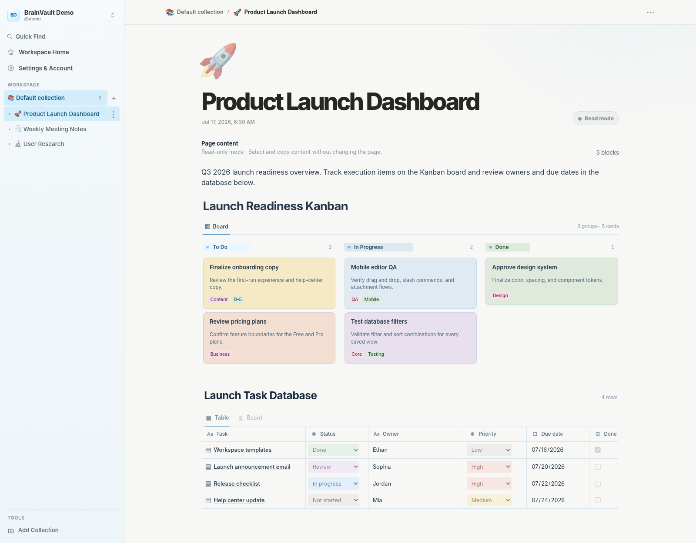

# BrainVault

BrainVault is a self-hosted, block-based note app built with Node.js, Express, TypeScript, and MariaDB. It combines a focused browser workspace with a REST API, so it can be used as both a personal writing environment and a backend for other clients.

Every row on a page is an editable block that can be formatted, moved, nested, or converted without switching to a separate preview pane.

## Preview



The preview is captured from the real browser UI. See [Development guide](docs/development/2026-07-28/development.md#preview-capture) to regenerate it.

## Key features

- Block editor with slash commands, nested content, drag-and-drop ordering, tables, databases, Kanban boards, and Gantt timelines
- Rich text, Markdown, syntax-highlighted code blocks, callouts, bookmarks, YouTube video embeds, file attachments, AI conversation blocks, and KaTeX formulas
- Crash-resilient browser drafts, automatic title saving, and search across page titles and block content
- Owner-managed page sharing with Yjs-based simultaneous title/block editing, live presence, reconnect recovery, and MariaDB persistence
- Page collections, nesting, archiving, permanent deletion, PDF export, and complete ZIP backup/restore including sharing grants
- JWT authentication with an HttpOnly browser session cookie, profile settings, TOTP authenticator support, and multiple WebAuthn/FIDO2 passkeys
- Seven interface languages: English, Japanese, Korean, French, German, Spanish, and Portuguese
- Private attachment storage, sanitized Markdown rendering, rate limiting, and validated bookmark previews
- Automatic MariaDB bootstrap and migrations, plus an included OpenAPI 3.1 specification
- Production HTTPS via a Posh-ACME certificate directory or a trusted Caddy, Synology DSM, NGINX, or Nginx Proxy Manager reverse proxy

## Syntax-highlighted code blocks

Code blocks include a language selector, a live highlighted preview, persisted language metadata, read-only/PDF rendering, and highlighted fenced code inside Markdown blocks. Highlight.js assets are served locally from `public/vendor/highlight`, so code highlighting does not require a third-party CDN.

Supported selectors include C, C++, C#, Java, Python, Dart, Rust, Lua, Ruby, Perl, Bash, PowerShell, JSON, SQL, XML, YAML, Markdown, HTML, JavaScript, CSS, PHP, VB.NET, BASIC, Assembly, Delphi, Lisp, TypeScript, CoffeeScript, COBOL, Fortran (`POTRAN` is accepted as an alias), MATLAB, Kotlin, Objective-C, Swift, and Haskell.

## Stack

| Area | Technology |
| --- | --- |
| Runtime | Node.js 22.13+, Express 5, TypeScript |
| Database | MariaDB |
| Frontend | Vanilla HTML, CSS, and JavaScript, with Yjs 13.6.31 for shared documents |
| Auth | JWT, bcrypt, TOTP, and WebAuthn/FIDO2 |
| Validation and rendering | Zod, markdown-it, sanitize-html, and KaTeX |
| Testing | Vitest and Supertest |

## Quick start

Requirements: Node.js 22.13 or newer, npm 10.9 or newer, and a reachable MariaDB server.

```bash
npm run db:configure
npm install
npm run setup
npm run dev
```

`npm run dev` opens `http://localhost:4000` automatically in a private/incognito window after the server is ready. It never falls back to a normal browser profile.

For database permissions, opt-in demo data, alternative environment setup, and production instructions, see the [Getting started guide](docs/getting-started/2026-07-27/getting-started.md).

## Documentation

| Guide | Contents |
| --- | --- |
| [Documentation index](docs/README.md) | Entry point for all project documentation |
| [Getting started](docs/getting-started/2026-07-27/getting-started.md) | Requirements, secure setup, database bootstrap, opt-in demo data, and production |
| [Features](docs/features/2026-07-30/features.md) | Editor behavior, sharing, block types, backup/restore, PDF export, and languages |
| [Collaboration](docs/collaboration/2026-07-29/collaboration.md) | Sharing permissions, Yjs/WebSocket flow, persistence, proxy setup, and verification |
| [Collaboration verification](docs/data-loss/2026-07-29/collaboration-verification.md) | Delivery checks, integrity-proof scope, and reproducible deployment validation |
| [Data-loss and integrity reports](docs/README.md#data-loss-and-integrity-reports) | Dated audits, reproductions, corrections, and verification evidence |
| [Configuration](docs/configuration/2026-07-28/configuration.md) | Environment variables and runtime configuration |
| [HTTPS deployment](deploy/README.md) | Direct Posh-ACME TLS plus Caddy, Synology DSM, NGINX, and Nginx Proxy Manager setup |
| [Security](docs/security/2026-07-30/security.md) | MFA, production secrets, attachment safety, and security defaults |
| [API](docs/api/2026-07-30/api.md) | Route overview, authentication, health check, and OpenAPI access |
| [Development](docs/development/2026-07-28/development.md) | Scripts, lockfile policy, project structure, translations, and preview capture |
| [OpenAPI specification](docs/api/2026-07-30/openapi.yaml) | Full OpenAPI 3.1 document |

## Common commands

```bash
npm run dev       # Start the server and open a private/incognito browser window
npm run secrets:generate # Print independent 32-byte JWT and MFA secrets
npm test          # Run the test suite
npm run build     # Compile TypeScript
npm run reproduce:cross-instance-loss # Reproduce the stale-room compaction loss and fixed behavior
npm run reproduce:attachment-position-loss # Reproduce stale-SQL attachment position loss and the fixed merge
npm run verify:collaboration # Check collaboration wiring, protocol behavior, and source syntax
npm run verify:data-loss # Check persistence and recovery integrity guards
npm start         # Run the compiled server
```

Before a production deployment, provide explicit unique secrets, configure the browser origins, leave registration disabled unless it is intentionally required, and serve the app over HTTPS in a browser that supports Web Locks so safety-critical cross-tab transitions can run. To let BrainVault serve Posh-ACME's `fullchain.cer` and `cert.key` directly, use `HTTPS_MODE=posh-acme` and set `POSH_ACME_CERT_PATH`. For TLS termination in Caddy, Synology DSM, NGINX, or Nginx Proxy Manager, use `HTTPS_MODE=proxy`. Follow the [HTTPS deployment guide](deploy/README.md), then see [Security](docs/security/2026-07-30/security.md) and [Configuration](docs/configuration/2026-07-28/configuration.md).
